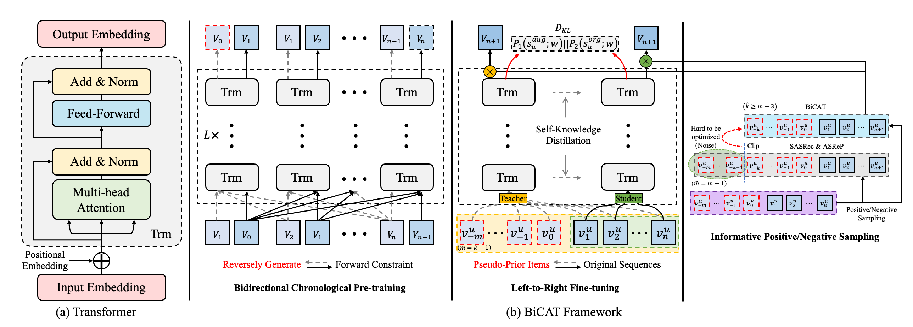

# BiCAT: Sequential Recommendation with Bidirectional Chronological Augmentation of Transformer
This is our TensorFlow implementation for the paper: "**[BiCAT: Sequential Recommendation with Bidirectional Chronological Augmentation of Transformer](https://arxiv.org/abs/2112.06460)**".
Our code is implemented based on TensorFlow version of [SASRec](https://github.com/kang205/SASRec) and [ASReP](https://github.com/DyGRec/ASReP). More useful repositories can be found in our [@AIM (DeepSE) Lab](https://github.com/AIM-SE) and [@juyongjiang](https://github.com/juyongjiang).

Please cite our paper if you find our code or paper useful:
```bibtex
@article{jiang2021sequential,
  title={Sequential Recommendation with Bidirectional Chronological Augmentation of Transformer},
  author={Jiang, Juyong and Luo, Yingtao and Kim, Jae Boum and Zhang, Kai and Kim, Sunghun},
  journal={arXiv preprint arXiv:2112.06460},
  year={2021}
}
```

## Paper Abstract
Sequential recommendation can capture user chronological preferences from their historical behaviors, yet the learning of short sequences is still an open challenge. Recently, data augmentation with pseudo-prior items generated by transformers has drawn considerable attention in improving recommendation in short sequences and addressing the cold-start problem. These methods typically generate pseudo-prior items sequentially in reverse chronological order (i.e., from the future to the past) to obtain longer sequences for subsequent learning. However, the performance can still degrade for very short sequences than for longer ones. In fact, reverse sequential augmentation does not explicitly take into account the forward direction, and so the underlying temporal correlations may not be fully preserved in terms of conditional probabilities. In this paper, we propose a Bidirectional Chronological Augmentation of Transformer (BiCAT) that uses a forward learning constraint in the reverse generative process to capture contextual information more effectively. The forward constraint serves as a bridge between reverse data augmentation and forward recommendation. It can also be used as pretraining to facilitate subsequent learning. Extensive experiments on two public datasets with detailed comparisons to multiple baseline models demonstrate the effectiveness of our method, especially for very short sequences (3 or fewer items). Source code is available at [this page](https://github.com/juyongjiang/BiCAT). 



## Environment
* TensorFlow 1.12
* Python 3.6.*

## Datasets Prepare
**Benchmarks**: Amazon Review datasets Beauty, Movie Lens and Cell_Phones_and_Accessories. 
The data split is done in the `leave-one-out` setting. Make sure you download the datasets from the [link](https://jmcauley.ucsd.edu/data/amazon/). Please, use the `DataProcessing.py` under the `data/`, and make sure you change the DATASET variable value to your dataset name, then you run:

```
python DataProcessing.py
```

You will find the processed dataset in the directory with the name of your input dataset.

## Beauty
**1. Reversely Pre-training and Short Sequence Augmentation**

Pre-train the model and output 20 items for sequences with length <= 20.

```
python main.py \
       --dataset=Beauty \
       --train_dir=default \
       --lr=0.001 \
       --hidden_units=128 \
       --maxlen=100 \
       --dropout_rate=0.7 \
       --num_blocks=2 \
       --l2_emb=0.0 \
       --num_heads=4 \
       --evalnegsample 100 \
       --reversed 1 \
       --reversed_gen_num 20 \
       --M 20
```
**2. Next-Item Prediction with Reversed-Pre-Trained Model and Augmented dataset**

```
python main.py \
       --dataset=Beauty \
       --train_dir=default \
       --lr=0.001 \
       --hidden_units=128 \
       --maxlen=100 \
       --dropout_rate=0.7 \
       --num_blocks=2 \
       --l2_emb=0.0 \
       --num_heads=4 \
       --evalnegsample 100 \
       --reversed_pretrain 1 \
       --aug_traindata 15 \
       --M 18
```

## Cell_Phones_and_Accessories
**1. Reversely Pre-training and Short Sequence Augmentation**

Pre-train the model and output 20 items for sequences with length <= 20.

```
python main.py \
       --dataset=Cell_Phones_and_Accessories \
       --train_dir=default \
       --lr=0.001 \
       --hidden_units=32 \
       --maxlen=100 \
       --dropout_rate=0.5 \
       --num_blocks=2 \
       --l2_emb=0.0 \
       --num_heads=2 \
       --evalnegsample 100 \
       --reversed 1 \
       --reversed_gen_num 20 \
       --M 20

```
**2. Next-Item Prediction with Reversed-Pre-Trained Model and Augmented dataset**

```
python main.py \
       --dataset=Cell_Phones_and_Accessories \
       --train_dir=default \
       --lr=0.001 \
       --hidden_units=32 \
       --maxlen=100 \
       --dropout_rate=0.5 \
       --num_blocks=2 \
       --l2_emb=0.0 \
       --num_heads=2 \
       --evalnegsample 100 \
       --reversed_pretrain 1 \ 
       --aug_traindata 17 \
       --M 18
```
## Contact
Feel free to contact us if there is any question. (Juyong Jiang, juyongjiang@ust.hk; Russell KIM, russellkim@upstage.ai)